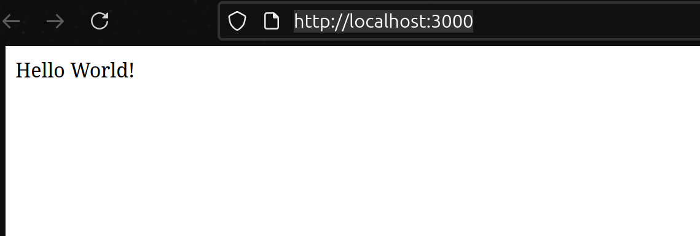
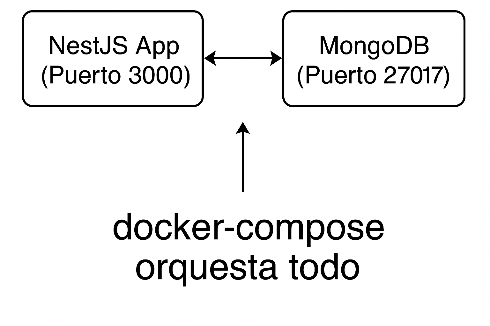

# Desafío 5: Docker, NestJS y MongoDB:

## Pasos para levantar el entorno:

Primer paso: Clonar el repositorio de la aplicación:
https://github.com/yosoyfunes/app-template-nestjs.git

Segundo paso: Crear los archivos dockerfile y docker-compose.yml en la raíz del proyecto.

Tercer paso: Ejecutar:

```bash
docker-compose up -d
```
Cuarto paso: Acceder a la aplicación en el navegador en la siguiente URL:

```
http://localhost:3000
```
Resultado: Deberías ver un mensaje que dice "Hello World!" en la página.



## Diagrama:

